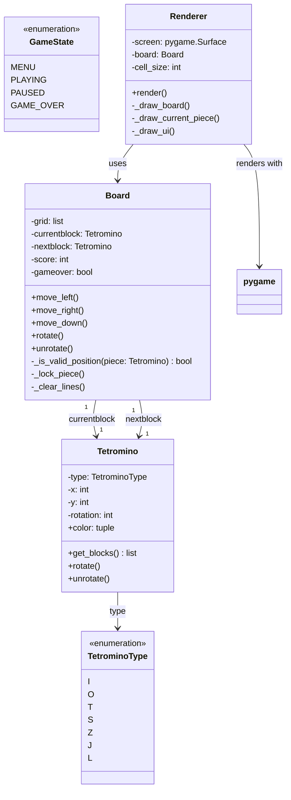
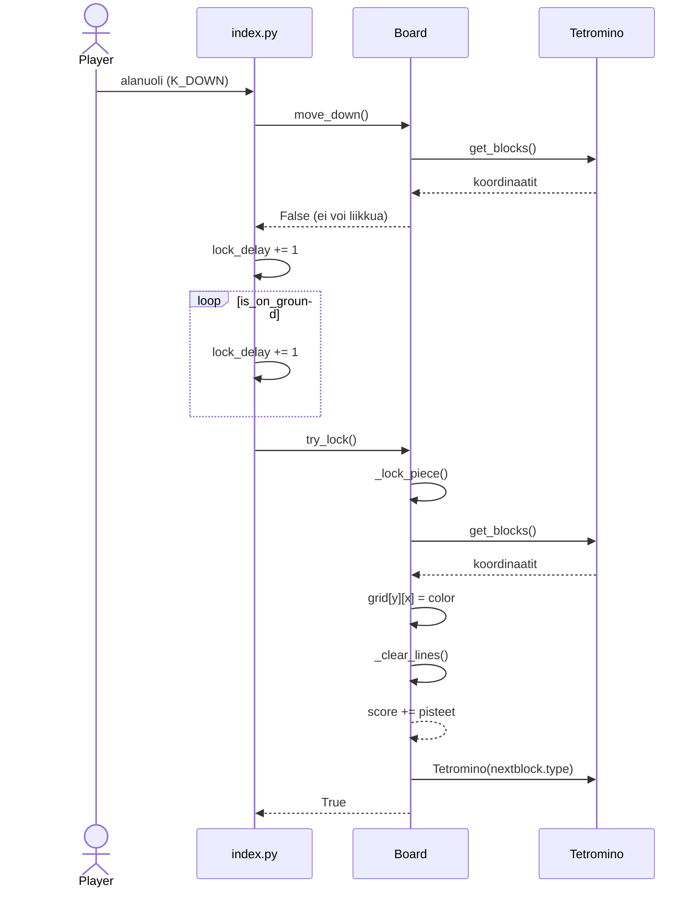

# Tetris - Luokkakaavio

## Luokkien kuvaukset

### Board
- Hallinnoi pelilautaa ja pelimekaniikkaa
- Säilyttää pelaajan pisteit' ja nykyisen palikoiden tilan
- Käsittelee palikan liikkeet (vasen, oikea, alas) ja rotaation

### Tetromino
- Säilyttää palikan tyypin, sijainnin ja rotaatiosuunnan
- Laskee palikan nykyiset ruudukon koordinaatit

### TetrominoType
- Numeroidut palikka tyypit
- I, O, T, S, Z, J, L

### Renderer
- Piirtää peliruudun ja visuaaliset elementit
- Käyttää Pygamea renderointiin

### GameState
- Numerot pelin eri tiloille
- Käytetään pelin tilanhallintaan

# Tetris - Sekvenssikaavio
Sovelluksen toimintologiikka sekvenssikaaviona.

Kun pelaaja painaa alanuolta ja palikka osuu pohjaan tai toiseen palikkaan, etenee logiikka alla olevan kaavion mukaisesti

move_down() palauttaa False, kun palikka ei enää pysty liikkumaan alaspäin ja asettaa is_on_ground-lipun todeksi.
Tämän jälkeen index.py alkaa kasvattaa lock_delay-laskuria joka framella. Kun laskuri saavuttaa maksimin (LOCK_DELAY_MAX), kutsutaan try_lock()-metodia.
Board lukitsee palikan kirjoittamalla sen värin ruudukkoon _lock_piece()-metodissa, minkä jälkeen kutsutaan _clear_lines(), joka poistaa täydet rivit ja lisää pisteet.
Lopuksi currentblock vaihdetaan aiemmin arvottuun nextblock-palikkaan ja arvotaan uusi tuleva palikka.
