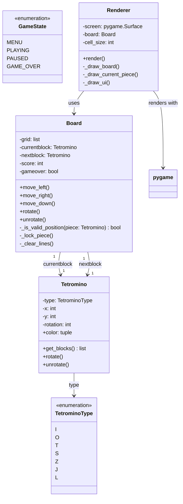

# Tetris - Luokkakaavio

## Luokkien kuvaukset

### Board
- Hallinnoi pelilautaa ja pelimekaniikkaa
- Säilyttää pelaajan pisteit' ja nykyisen palikoiden tilan
- Käsittelee palikan liikkeet (vasen, oikea, alas) ja rotaation

### Tetromino
- Säilyttää palikan tyypin, sijainnin ja rotaatiosuunnan
- Laskee palikan nykyiset ruudukon koordinaatit

### TetrominoType
- Numeroidut palikka tyypit
- I, O, T, S, Z, J, L

### Renderer
- Piirtää peliruudun ja visuaaliset elementit
- Käyttää Pygamea renderointiin

### GameState
- Numerot pelin eri tiloille
- Käytetään pelin tilanhallintaan
