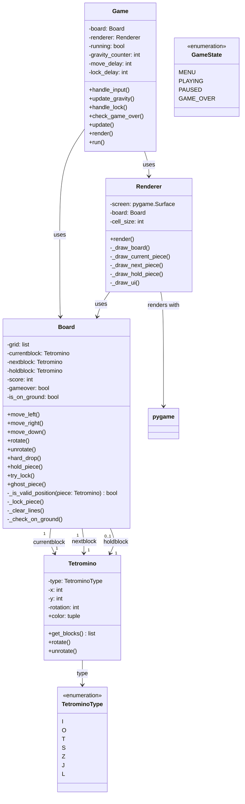
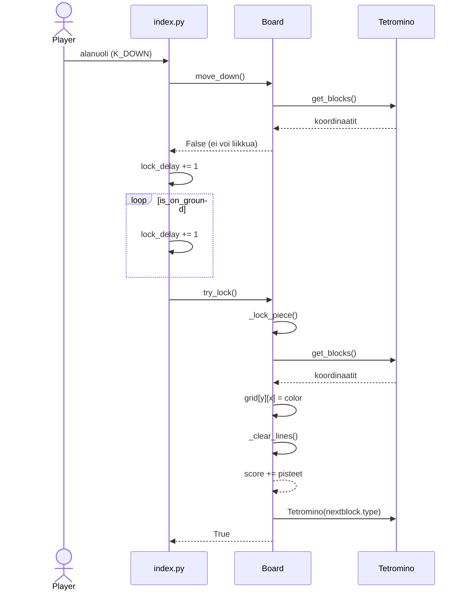

# Tetris - Arkkitehtuurikuvaus

## Korkean tason rakenne

Sovellus on jaettu kolmeen pääkomponenttiin:

```
src/
├── index.py           # Pääohjelma - Game-luokka ja main()
├── game/              # Sovelluslogiikka
│   ├── __init__.py
│   ├── config.py      # Pelin konfiguraatiot ja vakiot
│   ├── board.py       # Peliruudukko ja pelimekaniikka
│   ├── tetrominoes.py # Tetris-palikat
│   └── game_state.py  # Pelin tilan enum
├── graphics/          # Grafiikka ja renderöinti
│   ├── __init__.py
│   └── renderer.py    # Pygame renderöinti
└── tests/
    ├── __init__.py
    └── test_board.py  # Yksikkötestit
```

## Komponenttien kuvaus

### game/ (Sovelluslogiikka)

#### **config.py**
- Sisältää kaikki pelin vakiot ja konfiguraatiot
- CELL_SIZE, BOARD_WIDTH, BOARD_HEIGHT, FPS, DAS, ARR jne.
- FONT_PATH: fontin sijainti

#### **board.py - Board-luokka**
- Hallinnoi Tetris-pelilautaa (10x20 ruudukko)
- Ylläpitää pelitilaa:
  - `grid`: peliruudukko
  - `currentblock`: nykyinen palikka
  - `nextblock`: seuraava palikka
  - `holdblock`: hold-toiminnolla pidetty palikka
  - `score`: pelaajan pisteet
  - `gameover`: pelin lopetustieto
  - `is_on_ground`: onko palikka pohjassa

- Päämenetelmät:
  - `move_left()`, `move_right()`, `move_down()`: palikan liikkeet
  - `rotate()`, `unrotate()`: palikan rotaatiot wall-kick mekanikalla
  - `hard_drop()`: nopea pudotus
  - `try_lock()`, `_lock_piece()`: palikan lukitseminen
  - `ghost_piece()`: näkyvä varjo mihin palikka putoaa
  - `hold_piece()`: hold-toiminto
  - `_clear_lines()`: täysien rivien poistaminen ja pisteenlaskenta

#### **tetrominoes.py - Tetromino-luokka**
- Edustaa yhtä Tetris-palikkaa
- Ominaisuudet:
  - `type`: palikan tyyppi (I, O, T, S, Z, J, L)
  - `x, y`: palikan sijainti pelilaudalla
  - `rotation`: palikan rotaatiotila (0-3)
  
- Menetelmät:
  - `get_blocks()`: palauttaa palikan ruudukon koordinaatit
  - `rotate()`, `unrotate()`: rotaatiot
  - `color`: property, palauttaa palikan värin

#### **game_state.py - GameState-enum**
- Pelin mahdolliset tilat (MENU, PLAYING, PAUSED, GAME_OVER)
- Tällä hetkellä käyttämätön, varaus tulevaisuuden kehitykselle

### graphics/ (Grafiikka)

#### **renderer.py - Renderer-luokka**
- Hallinnoi pelin visualisointia Pygame-kirjastolla
- Piirtää:
  - `render()`: kaiken näytölle
  - `_draw_board()`: paikallaan olevat palikat
  - `_draw_current_piece()`: nykyinen palikka ja varjo
  - `_draw_next_piece()`: seuraava palikka näyttöön
  - `_draw_hold_piece()`: hold-palikka näyttöön
  - `_draw_ui()`: käyttöliittymä (pisteet, tekstit)

### index.py (Pääohjelma)

#### **Game-luokka**
- Pääsovelluksen logiikka
- Hallinnoi pelin silmukkaa ja tilamuutoksia

- Ominaisuudet:
  - `board`: Board-objekti
  - `renderer`: Renderer-objekti
  - `running`: pelin tila
  - Laskurit: gravity_counter, move_delay, lock_delay

- Päämenetelmät:
  - `handle_input()`: käyttäjän syötteiden käsittely
  - `update_gravity()`: palikan painovoiman hallinta
  - `handle_lock()`: palikan lukitseminen
  - `check_game_over()`: pelin loppumisen tarkistus
  - `update()`: kaiken päivitys
  - `render()`: näytön piirtäminen
  - `run()`: peli silmukka

## Tiedonkulku

```
Game.run() (peli silmukka)
  ├── handle_input() → Board (liikkeet, rotaatiot)
  ├── update_gravity() → Board.move_down()
  ├── handle_lock() → Board.try_lock()
  ├── check_game_over() → Board.gameover
  └── render() → Renderer.render() → näyttö
```

## Arkkitektuurin edut

- **Modulaarinen**: Jokainen komponentti on riippumaton
- **Testattava**: Board-logiikkaa voidaan testata ilman Renderiä
- **Laajentuva**: Uusia ominaisuuksia helppoa lisätä
- **Ylläpidettävä**: Konfiguraatiot erillisessä tiedostossa

---

# Tetris - Luokkakaavio



---
Sovelluksen toimintologiikka sekvenssikaaviona.

Kun pelaaja painaa alanuolta ja palikka osuu pohjaan tai toiseen palikkaan, etenee logiikka alla olevan kaavion mukaisesti


move_down() palauttaa False, kun palikka ei enää pysty liikkumaan alaspäin ja asettaa is_on_ground-lipun todeksi.
Tämän jälkeen index.py alkaa kasvattaa lock_delay-laskuria joka framella. Kun laskuri saavuttaa maksimin (LOCK_DELAY_MAX), kutsutaan try_lock()-metodia.
Board lukitsee palikan kirjoittamalla sen värin ruudukkoon _lock_piece()-metodissa, minkä jälkeen kutsutaan _clear_lines(), joka poistaa täydet rivit ja lisää pisteet.
Lopuksi currentblock vaihdetaan aiemmin arvottuun nextblock-palikkaan ja arvotaan uusi tuleva palikka.
