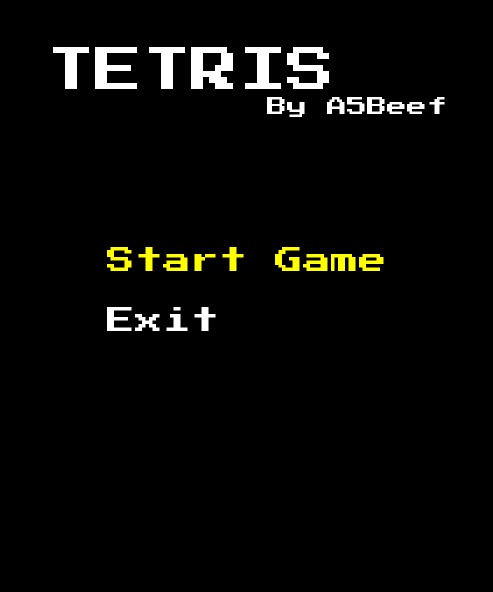
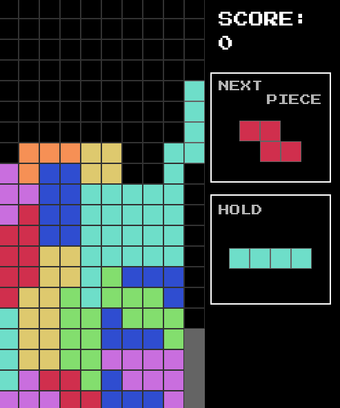
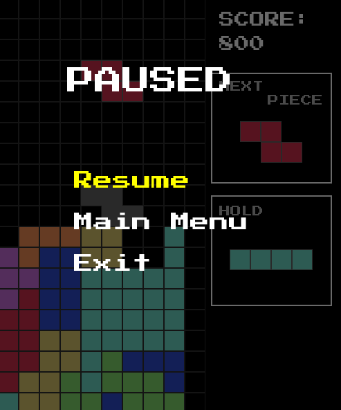
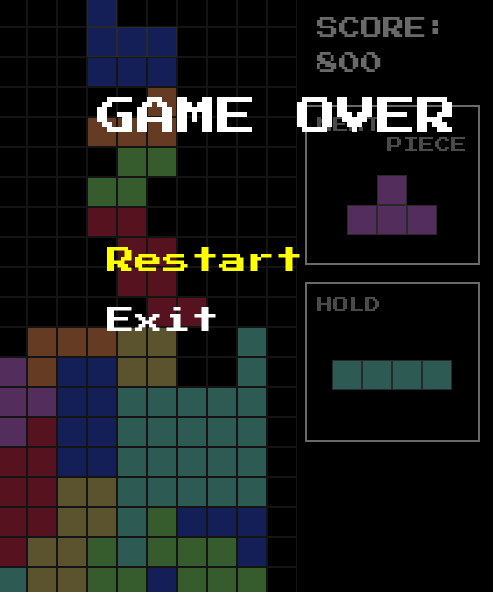

---

# Käyttöohje

Lataa projektin viimeisimmän [releasen](https://github.com/A5Beef/ot-harjoitustyo/releases) lähdekoodi valitsemalla _Assets_-osion alta _Source code_.

## Ohjelman käynnistäminen

Asenna ensin riippuvuudet komennolla:

```bash
poetry install
```

Ohjelman voi käynnistää seuraavalla komennolla:

```bash
poetry run invoke start
```

## Päävalikko

Sovellus käynnistyy päävalikkoon. Valikossa voi liikkua nuolinäppäimillä ja valita välilyönnillä.


- **Start Game** – aloittaa uuden pelin
- **Exit** – sulkee sovelluksen

## Pelaaminen



### Kontrollit

| Näppäin | Toiminto |
|---------|----------|
| ← → | Liiku vasemmalle/oikealle |
| ↓ | Soft drop |
| Välilyönti | Hard drop |
| X | Kierrä myötäpäivään |
| Z | Kierrä vastapäivään |
| Shift | Hold |
| Escape | Pause |

### Pisteytys

| Rivejä kerralla | Pisteet |
|-----------------|---------|
| 1 | 100 |
| 2 | 300 |
| 3 | 500 |
| 4 (Tetris) | 800 |

## Pause-valikko


Pelin voi keskeyttää Escape-näppäimellä. Valikossa voi valita:

- **Resume** – jatkaa peliä
- **Main Menu** – palaa päävalikkoon
- **Exit** – sulkee sovelluksen

## Game Over


Pelin päätyttyä voi valita:

- **Restart** – aloittaa uuden pelin
- **Exit** – sulkee sovelluksen

---
