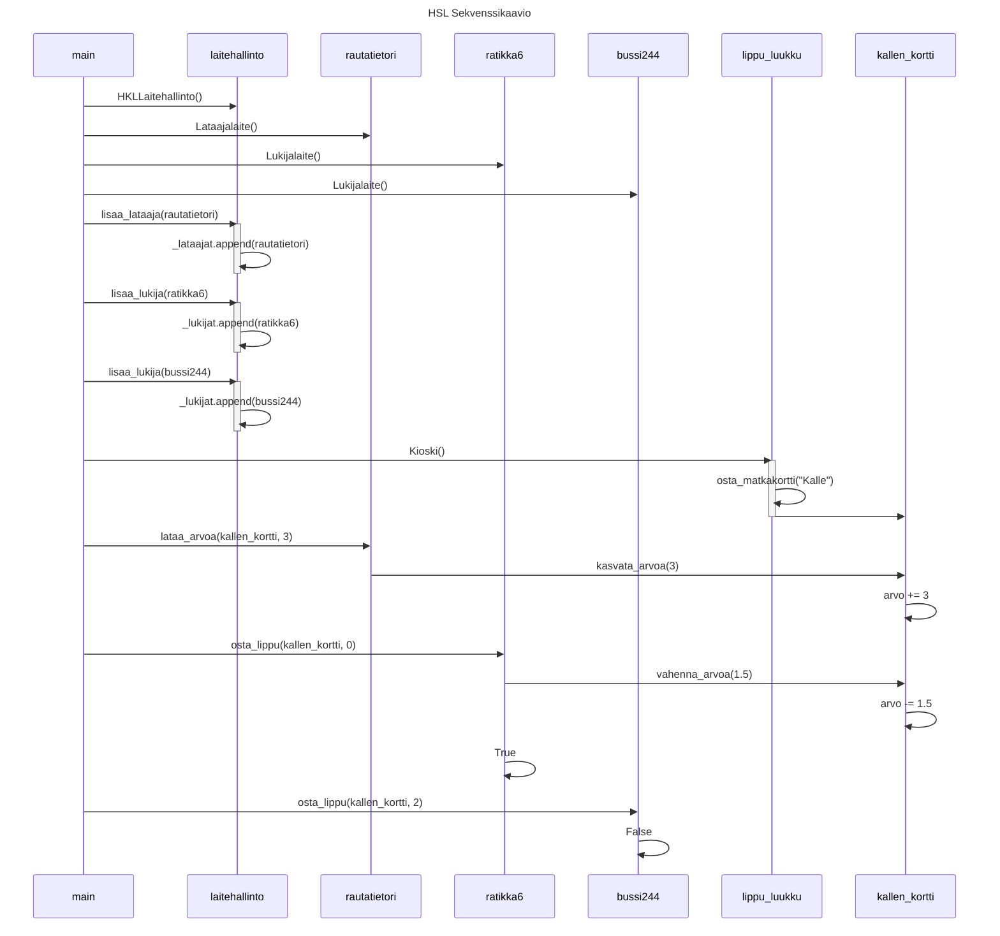

## HSL, sekvenssikaavio

```mermaid
---
title: HSL Sekvenssikaavio
---
sequenceDiagram
  participant main
  participant laitehallinto
  participant rautatietori
  participant ratikka6
  participant bussi244
  main->> laitehallinto: HKLLaitehallinto()
  main->>rautatietori: Lataajalaite()
  main->>ratikka6: Lukijalaite()
  main->>bussi244: Lukijalaite()
  main->>laitehallinto: lisaa_lataaja(rautatietori)
  activate laitehallinto
  laitehallinto->>laitehallinto: _lataajat.append(rautatietori)
  deactivate laitehallinto
  main->>laitehallinto: lisaa_lukija(ratikka6)
  activate laitehallinto
  laitehallinto->>laitehallinto: _lukijat.append(ratikka6)
  deactivate laitehallinto

  main->>laitehallinto: lisaa_lukija(bussi244)
  activate laitehallinto
  laitehallinto->>laitehallinto: _lukijat.append(bussi244)
  deactivate laitehallinto

  main->>lippu_luukku: Kioski()
  activate lippu_luukku
  lippu_luukku->>lippu_luukku: osta_matkakortti("Kalle")
  lippu_luukku->>kallen_kortti:
  deactivate lippu_luukku

  main->>rautatietori: lataa_arvoa(kallen_kortti, 3)
  rautatietori->>kallen_kortti: kasvata_arvoa(3)
  kallen_kortti->>kallen_kortti: arvo += 3

  main->>ratikka6: osta_lippu(kallen_kortti, 0)
  ratikka6->>kallen_kortti: vahenna_arvoa(1.5)
  kallen_kortti->>kallen_kortti: arvo -= 1.5
  ratikka6->>ratikka6: True

  main->>bussi244: osta_lippu(kallen_kortti, 2)
  bussi244->>bussi244: False
  
  
  
  

```
