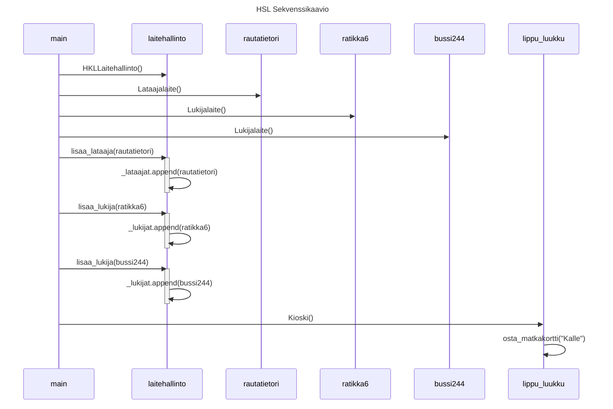

## HSL, sekvenssikaavio

```mermaid
---
title: HSL Sekvenssikaavio
---
sequenceDiagram
  participant main
  participant laitehallinto
  participant rautatietori
  participant ratikka6
  participant bussi244
  main->> laitehallinto: HKLLaitehallinto()
  main->>rautatietori: Lataajalaite()
  main->>ratikka6: Lukijalaite()
  main->>bussi244: Lukijalaite()
  main->>laitehallinto: lisaa_lataaja(rautatietori)
  activate laitehallinto
  laitehallinto->>laitehallinto: _lataajat.append(rautatietori)
  deactivate laitehallinto
  main->>laitehallinto: lisaa_lukija(ratikka6)
  activate laitehallinto
  laitehallinto->>laitehallinto: _lukijat.append(ratikka6)
  deactivate laitehallinto

  main->>laitehallinto: lisaa_lukija(bussi244)
  activate laitehallinto
  laitehallinto->>laitehallinto: _lukijat.append(bussi244)
  deactivate laitehallinto

  main->>lippu_luukku: Kioski()
  lippu_luukku->>lippu_luukku: osta_matkakortti("Kalle")
  

```
